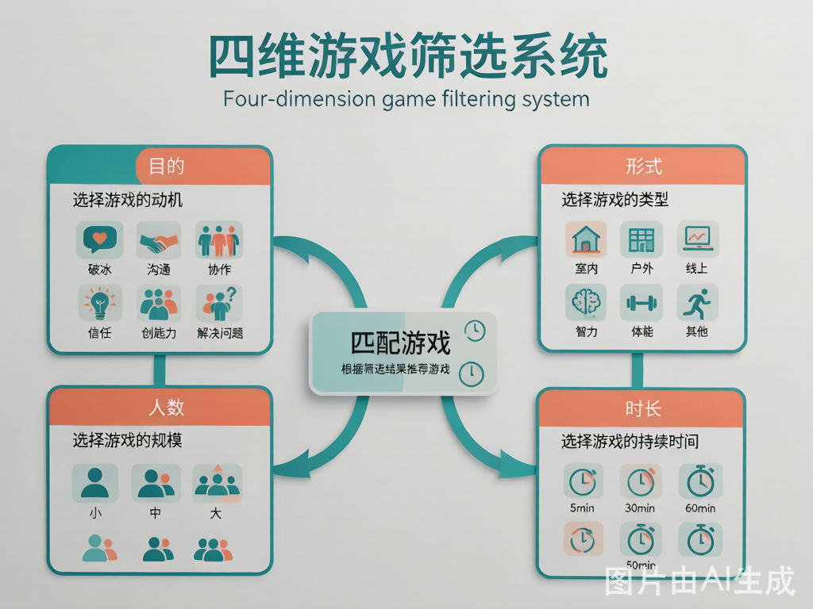
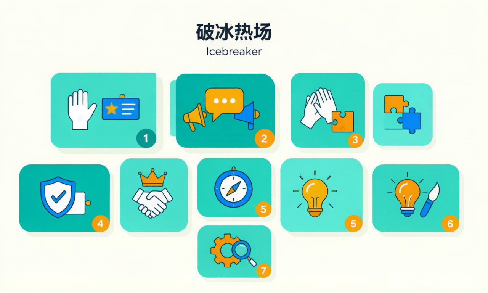

# 团建 & 培训游戏库


> 面向培训老师、团建教练的实用游戏与流程资源库。
> 所有游戏统一收录，通过标签区分使用场景（团建 / 培训 / 通用）。

---

## 快速检索

按四个维度快速匹配适合的游戏：

| 维度 | 选项 |
|------|------|
| **目的** | 破冰热场 · 沟通表达 · 团队协作 · 信任建立 · 领导力 · 创新思维 · 问题解决 |
| **形式** | 室内 · 户外 · 线上 · 智力 · 体力 · 混合 |
| **人数** | 小组 < 10人 · 中组 10–30人 · 大组 > 30人 · 任意人数 |
| **时长** | 热身 5–15 min · 短篇 15–30 min · 中篇 30–60 min · 长篇 > 60 min |

👉 使用方式：确定当前场景的四个维度 → 在下方索引表中筛选 → 打开对应游戏文档。



---

## 游戏索引



### 按目的分类

#### 🧊 破冰热场（icebreaker）
| 游戏名称 | 形式 | 人数 | 时长 | 场景标签 |
|---------|------|------|------|---------|
| [人类宾果](games/icebreaker/human-bingo.md) | 室内 · 智力 | 任意（8-50人） | 5-15 min | 团建/培训 |
| [两真一假](games/icebreaker/two-truths-one-lie.md) | 室内 · 智力 | 5-30人 | 10-20 min | 团建/培训 |
| [名字接龙](games/icebreaker/name-chain.md) | 室内/户外 · 智力 | 任意 | 5-10 min | 团建/培训 |
| [盲盒神话（改造版）](games/icebreaker/blind-box-myth.md) | 室内 · 卡牌+交易 | 4-8人/组 | 30-40 min | 团建/培训/破冰 |
| [美食挑战赛（改造版）](games/icebreaker/food-challenge.md) | 室内 · 卡牌+趣味 | 4-7人/组 | 30-40 min | 团建/培训/破冰 |
| [探险家日记（改造版）](games/icebreaker/explorer-journal.md) | 室内 · 分享+故事 | 6-16人 | 30-45 min | 团建/培训/破冰 |
| [台词之王（改造版）](games/icebreaker/line-master.md) | 室内 · 表演+即兴 | 6-20人 | 30-50 min | 团建/培训/破冰 |

#### 💬 沟通表达（communication）
| 游戏名称 | 形式 | 人数 | 时长 | 场景标签 |
|---------|------|------|------|---------|
| [盲人方阵](games/communication/blind-polygon.md) | 室内/户外 · 混合 | 8-24人 | 30-45 min | 团建/培训 |
| [传话游戏](games/communication/telephone-game.md) | 室内/户外 · 智力+趣味 | 8-30人 | 15-25 min | 培训/团建/破冰 |
| [你说我画](games/communication/draw-guess.md) | 室内 · 智力+趣味 | 2人/组 | 20-30 min | 培训/团建/工作坊 |
| [画图接龙](games/communication/drawing-relay.md) | 室内 · 趣味+创意 | 4-8人/组 | 20-30 min | 团建/培训/破冰 |
| [动物城大侦探（改造版）](games/communication/animal-detective.md) | 室内 · 推理+讨论 | 4-12人 | 30-45 min | 培训/团建 |
| [时间特工（改造版）](games/communication/time-agents.md) | 室内 · 推理+心理博弈 | 6-12人 | 30-45 min | 团建/培训/破冰 |
| [谣言工厂（改造版）](games/communication/rumor-factory.md) | 室内 · 倾听+传递 | 6-16人 | 30-45 min | 团建/培训/信任建设 |

#### 🤝 团队协作（collaboration）
| 游戏名称 | 形式 | 人数 | 时长 | 场景标签 |
|---------|------|------|------|---------|
| [人结](games/collaboration/human-knot.md) | 室内/户外 · 混合 | 8-20人 | 30-45 min | 团建/培训 |
| [齐眉棍](games/collaboration/eyebrow-stick.md) | 室内/户外 · 体力+协作 | 8-20人 | 20-30 min | 团建/培训/工作坊 |
| [珠行万里](games/collaboration/ball-relay.md) | 室内/户外 · 体力+协作 | 8-30人 | 20-30 min | 团建/培训/工作坊 |
| [风火轮](games/collaboration/wind-fire-wheel.md) | 户外/室内 · 体力+协作 | 8-15人/组 | 30-40 min | 团建/培训 |
| [人体拼字](games/collaboration/body-letters.md) | 室内/户外 · 体力+创意 | 6-20人/组 | 20-30 min | 团建/培训/破冰 |
| [岛屿求生（改造版）](games/collaboration/island-survival.md) | 室内 · 策略+协作 | 4-16人 | 45-75 min | 团建/培训/工作坊 |
| [魔法学院（改造版）](games/collaboration/magic-academy.md) | 室内 · 合作+策略 | 4-8人 | 45-60 min | 团建/培训/工作坊 |
| [星际矿工（改造版）](games/collaboration/space-miners.md) | 室内 · 合作+危机管理 | 5-8人 | 45-60 min | 团建/培训/工作坊 |
| [疯狂厨房（改造版）](games/collaboration/crazy-kitchen.md) | 室内 · 合作+时间压力 | 4-8人 | 30-45 min | 团建/培训/破冰 |
| [病毒危机（改造版）](games/collaboration/virus-outbreak.md) | 室内 · 合作+危机管理 | 4-12人 | 45-60 min | 团建/培训/工作坊 |
| [协作大厨（改造版）](games/collaboration/team-chef.md) | 室内 · 合作+流水线 | 4-8人 | 30-45 min | 团建/培训/工作坊 |
| [怪兽守护者（改造版）](games/collaboration/kaiju-defenders.md) | 室内 · 合作+危机管理 | 8-20人 | 60-75 min | 团建/培训/工作坊 |
| [绝密行动（改造版）](games/collaboration/secret-mission.md) | 室内 · 合作+隐秘协作 | 4-8人 | 45-60 min | 团建/培训/工作坊 |
| [基因疗法攻坚（改造版）](games/collaboration/gene-therapy.md) | 室内 · 合作+研发模拟 | 5-10人 | 60-75 min | 团建/培训/工作坊 |
| [怪物厨师（改造版）](games/collaboration/monster-chef.md) | 室内 · 合作+烹饪协作 | 3-6人 | 50-70 min | 团建/培训/破冰 |
| [深海探险（改造版）](games/collaboration/abyss-dive.md) | 室内 · 合作+资源管理 | 3-6人 | 50-70 min | 团建/培训/工作坊 |
| [末日种子库（改造版）](games/collaboration/doomsday-vault.md) | 室内 · 合作+危机管理 | 3-6人 | 60-75 min | 团建/培训/工作坊 |
| [芙莉莲的旅程（改造版）](games/collaboration/frieren-journey.md) | 室内 · 合作+目标共识 | 2-4人 | 60-90 min | 团建/培训/工作坊 |
| [大圣西游（改造版）](games/collaboration/wukong-quest.md) | 室内 · 合作+角色互补 | 4-6人 | 60-90 min | 团建/培训/工作坊 |
| [幽灵古堡（改造版）](games/collaboration/ghost-castle.md) | 室内 · 合作+危机救援 | 3-5人 | 45-75 min | 团建/培训/工作坊 |
| [鬼杀队：无限列车（改造版）](games/collaboration/demon-slayer-train.md) | 室内 · 合作+危机突破 | 3-5人 | 45-75 min | 团建/培训/工作坊 |
| [神话裂隙（改造版）](games/collaboration/mythic-rift.md) | 室内 · 合作+心智韧性 | 3-5人 | 60-90 min | 团建/培训/工作坊 |
| [天命人（改造版）](games/collaboration/destined-one.md) | 室内 · 合作+资源管理 | 4-6人 | 60-90 min | 团建/培训/工作坊 |
| [咒术回战：术师联携（改造版）](games/collaboration/jujutsu-united.md) | 室内 · 合作+风险治理 | 3-5人 | 45-75 min | 团建/培训/工作坊 |
| [轮回地下城（改造版）](games/collaboration/loop-dungeon.md) | 室内 · 合作+复盘迭代 | 3-5人 | 45-60 min | 团建/培训/工作坊 |
| [星际医疗队（改造版）](games/collaboration/stellar-medics.md) | 室内 · 合作+危机管控 | 3-5人 | 45-70 min | 团建/培训/工作坊 |
| [远征33号（改造版）](games/collaboration/expedition-33.md) | 室内 · 合作+目标共识 | 2-4人 | 45-75 min | 团建/培训/工作坊 |
| [星际灯塔守护者（改造版）](games/collaboration/stellar-lighthouse.md) | 室内 · 合作+长期守护 | 3-5人 | 45-70 min | 团建/培训/工作坊 |
| [猎人小队（改造版）](games/collaboration/solo-hunter-squad.md) | 室内 · 合作+能力提升 | 3-5人 | 45-75 min | 团建/培训/工作坊 |
| [银河小馆（改造版）](games/collaboration/space-diner-escape.md) | 室内 · 合作+双线协同 | 3-5人 | 45-75 min | 团建/培训/工作坊 |
| [星际拓荒者（改造版）](games/collaboration/star-pioneers.md) | 室内 · 合作+从0到1拓荒 | 3-5人 | 45-70 min | 团建/培训/工作坊 |
| [黄金结界（改造版）](games/collaboration/huntrix-honmoon.md) | 室内 · 合作+文化守护 | 3-5人 | 45-75 min | 团建/培训/工作坊 |

#### 🔐 信任建立（trust）
| 游戏名称 | 形式 | 人数 | 时长 | 场景标签 |
|---------|------|------|------|---------|
| [信任背摔](games/trust/trust-fall.md) | 室内/户外 · 体力 | 8-20人 | 20-40 min | 团建 |
| [盲行](games/trust/blind-walk.md) | 室内/户外 · 混合 | 任意偶数 | 20-35 min | 团建/培训 |

#### 👑 领导力（leadership）
| 游戏名称 | 形式 | 人数 | 时长 | 场景标签 |
|---------|------|------|------|---------|
| [红黑游戏](games/leadership/red-black-game.md) | 室内 · 智力 | 12-40人 | 45-60 min | 培训 |
| [七巧板](games/leadership/tangram.md) | 室内 · 策略+协作 | 24-49人 | 60-90 min | 培训/工作坊 |
| [沉默领袖](games/leadership/silent-leader.md) | 室内/户外 · 体力+观察 | 8-20人 | 30-40 min | 培训/工作坊 |
| [七巧板](games/leadership/tangram.md) | 室内 · 策略+协作 | 24-49人 | 60-90 min | 培训/工作坊 |

#### 💡 创新思维（creativity）
| 游戏名称 | 形式 | 人数 | 时长 | 场景标签 |
|---------|------|------|------|---------|
| [10元买创意](games/creativity/10-yuan-idea.md) | 室内/户外 · 智力+动手 | 4–8人/组 | 30–45 min | 团建/培训/工作坊 |
| [报纸塔挑战](games/creativity/newspaper-tower.md) | 室内 · 动手+策略 | 4–6人/组 | 30–40 min | 团建/培训/工作坊 |

#### 🔧 问题解决（problem-solving）
| 游戏名称 | 形式 | 人数 | 时长 | 场景标签 |
|---------|------|------|------|---------|
| [沙漠逃生](games/problem-solving/desert-survival.md) | 室内 · 讨论+共识 | 6–12人 | 30–45 min | 培训/团建/工作坊 |
| [鸡蛋坠落挑战](games/problem-solving/egg-drop.md) | 室内/户外 · 动手+策略 | 4–6人/组 | 45–60 min | 团建/培训/工作坊 |

---

## 团建流程方案

| 方案名称 | 总时长 | 适合人数 | 核心目标 |
|---------|--------|---------|---------|
| [一日团建模板](flows/one-day/) | 6–8 小时 | 15–50人 | 破冰+协作+复盘 |
| [半日团建模板](flows/half-day/01-schedule.md) | 3–4 小时 | 10–30人 | 快速凝聚 |
| [主题工作坊模板](flows/workshop/leadership-awakening.md) | 2.5–3 小时 | 12–24人 | 领导力深度培训 |
| [线上团建模板](flows/online/01-schedule.md) | 2–2.5 小时 | 8–30人 | 远程团队团建 |
| [新员工融入团建流程](flows/onboarding/01-schedule.md) | 3–4 小时 | 8–20人 | 帮助新员工快速融入团队 |
| [跨部门协作团建流程](flows/cross-dept/01-schedule.md) | 6–7 小时 | 15–30人 | 打破部门墙，提升跨部门协作效率 |

👉 流程方案在 [`flows/`](flows/) 目录，每套方案包含：时间轴 + 游戏选配 + 引导要点 + 复盘设计。

---

## 教练工具箱

| 工具 | 说明 |
|------|------|
| [引导话术库](toolbox/facilitation.md) | 开场白、规则讲解、介入干预的话术模板 |
| [复盘引导框架](toolbox/debrief.md) | 4F模型、提问清单、典型场景复盘话术 |
| [安全与管理](toolbox/safety.md) | 户外安全清单、突发情况预案、免责声明 |
| [物资与效率工具](toolbox/checklist.md) | 通用物资清单、分组方法、效果评估问卷 |

---

## 单款游戏文档结构

每款游戏包含以下六个章节，方便教练即拿即用：

```
1. 概览与标签（名称、四维标签、难度、目标、适合场景）
2. 核心规则（简明规则、流程步骤、胜负判定）
3. 引导要点（如何讲解、示范要点、关键把控）
4. 复盘问题（4F模型引导提问清单）
5. 变体适配（不同人数/场景/时长的调整方案）
6. 物资清单（所需道具和准备事项）
```

---

## 使用指南

首次使用？先读 [教练使用指南](guide.md) —— 5 分钟了解如何选游戏、如何引导、如何复盘。

---

## 贡献与更新

欢迎补充新游戏或改进现有内容。新增游戏请遵循：
- 放入对应 `games/<目的>/` 目录
- 文件名使用英文小写 + 连字符（如 `human-bingo.md`）
- 在本文档的索引表中补充一行
- 包含完整的六个章节

---

_最后更新：2026-07-17_
