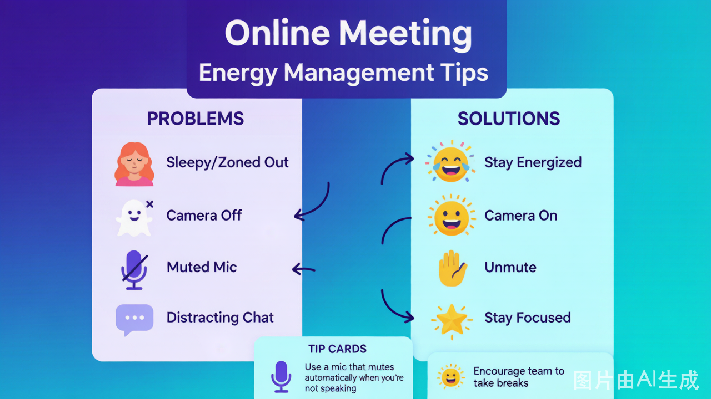

# 线上团建流程模板

| 00:00–00:15 | 线上开场 + 破冰 | 15 min | 打破屏幕隔阂、建立存在感 |
| 00:15–00:45 | 破冰游戏（线上版） | 30 min | 笑声破冰、记住彼此 |
| 00:45–01:15 | 核心活动 I | 30 min | 沟通表达 / 信任建立 |
| 01:15–01:25 | 课间休息 | 10 min | 离开屏幕、放松眼睛 |
| 01:25–01:55 | 核心活动 II | 30 min | 团队协作 / 问题解决 |
| 01:55–02:15 | 总结复盘 | 20 min | 提炼收获、情感连接 |

---

> **线上团建工具准备一览**

---

## 详细流程

### 第一阶段：线上开场（00:00–00:15）

#### 教练操作清单
- [ ] 提前 15 分钟进入会议室，测试屏幕共享
- [ ] 播放轻快背景音乐（共享电脑声音）
- [ ] 打开「虚拟背景」或「视频滤镜」，营造轻松氛围
- [ ] 等所有人到齐后，用**肢体动作**开场（不只是声音）

#### 开场白话术模板

| [名字接龙](https://aiworkdb.github.io/teambuilding/games/icebreaker/name-chain.html) | 用「轮流说话」代替「排队拍肩」 | 5 min |
| [人类宾果](https://aiworkdb.github.io/teambuilding/games/icebreaker/human-bingo.html) | **屏幕共享宾果卡**，所有人一起玩 | 10 min |
| 「背景大揭秘」 | 每人展示虚拟背景并解释 30 秒 | 10 min |

---

### 第二阶段：破冰游戏线上版（00:15–00:45）

#### 推荐游戏组合（任选一）

**方案 A：传话游戏线上版**
| 步骤 | 操作 | 时长 |
|------|------|------|
| 分组 | 用会议「分组讨论」功能，分 2–4 组 | 2 min |
| 游戏 | 每组私聊传话（用聊天框发私信） | 15 min |
| 展示 | 回到主会议室，每组展示「变形版」 | 10 min |
| 复盘 | 快速 4F（只做 Facts + Feelings） | 3 min |

| 工具准备 | 每人打开 [AWW App](https://awwapp.com) 或 Figma 白板 | 5 min |
| 分组 | 分 2 人/组（用分组讨论功能） | 2 min |
| 游戏 | 共享白板链接，一人描述一人画 | 15 min |
| 展示 | 教练把「神作」投屏（屏幕共享白板） | 8 min |

**方案 C：画图接龙线上版**
| 步骤 | 操作 | 时长 |
|------|------|------|
| 工具准备 | 教练创建 Miro 白板，分享链接 | 3 min |
| 游戏 | 每人画 15 秒，依次接龙 | 15 min |
| 展示 | 屏幕共享白板，全员投票 | 10 min |

---

### 第三阶段：核心活动 I（00:45–01:15）

#### 推荐游戏（线上适配版）

**方案 A：盲人方阵线上版**
| 调整 | 线上实现方式 |
|------|---------------|
| 「蒙眼」 | 要求所有人**关闭摄像头**（不是关，是用贴纸盖住） |
| 「绳子」 | 用在线白板画「虚拟绳子」，每人控制一个圆点 |
| 「不许说话」 | 全员**静音**，只能用白板聊天框沟通 |
| 时长 | 压缩为 25 min（线上注意力更短） |

**方案 B：沙漠逃生线上版** ⭐ 推荐
| 步骤 | 线上操作 | 时长 |
|------|----------|------|
| 分发任务 | 教练私信发「物品清单」PDF | 2 min |
| 个人排序 | 各人填 Google 表单（匿名） | 5 min |
| 分组讨论 | 用「分组讨论」功能，10 分钟自由讨论 | 10 min |
| 达成共识 | 在线文档（腾讯文档/Google Docs）实时编辑 | 8 min |
| 揭晓答案 | 屏幕共享 Excel，计算偏差分 | 5 min |

> 💡 **为什么推荐这个**：线上版「沙漠逃生」反而更好——因为「不能说话」的 limitation 本来就存在（打字）！

---

### 第四阶段：课间休息（01:15–01:25）

#### 教练操作
- [ ] 宣布休息时，给出**明确指令**：

| 分组 | 3–4 人/组，用分组讨论功能 | 2 min |
| 采购 | 在线搜索（每人用自己的手机/电脑） | 10 min |
| 创作 | 在线白板贴图 + 加文字说明 | 10 min |
| 路演 | 每组派 1 人共享屏幕，PPT 式路演 | 8 min |

---

### 第六阶段：总结复盘（01:55–02:15）

#### 线上复盘流程（20 分钟）

**第一步：在线投票回顾（3 min）**
- 教练用 Mentimeter 或腾讯投票，发起 2 个问题：
  1. 「今天哪个瞬间让你印象最深？」（单选）
  2. 「如果用一个词形容今天的感受，是什么？」（开放式）

**第二步：4F 模型引导（12 min）**

| 步骤 | 提问方式 | 时长 |
|------|----------|------|
| **Facts** | 「在聊天框打出：今天玩了几个游戏？」 | 2 min |
| **Feelings** | 「用 1 个emoji 表达你现在的感受，发在聊天框」 | 3 min |
| **Findings** | 分组讨论 3 分钟，然后每组派 1 人分享 1 个发现 | 5 min |
| **Future** | 「在聊天框打出：回到工作中，你会做 1 个什么不同的事？」 | 2 min |

**第三步：一句话收尾（5 min）**
- 按顺序，每人用**1 句话**分享今天最大的收获
- 教练最后说：

| **投票工具** | 复盘投票 | Mentimeter / 腾讯投票 |
| **屏幕共享** | 展示内容 | 会议自带功能 |

### 教练设备检查清单

| 检查项 | 说明 |
|--------|------|
| [ ] **网络稳定** | 用有线网络，不用 WiFi |
| [ ] **备用网络** | 手机热点备用 |
| [ ] **双设备登录** | 一台电脑共享屏幕，一台手机看聊天框 |
| [ ] **耳机麦克风** | 保证声音清晰 |
| [ ] **虚拟背景** | 统一用团建主题背景（可选） |
| [ ] **屏幕共享测试** | 提前测试「共享电脑声音」功能 |

---

## 线上团建特别注意事项

### 能量管理（比线下更难！）

| 问题 | 解决方案 |
|------|----------|
| **注意力流失** | 每 15 分钟换一次活动，不能长讲 |
| **「摄像头疲劳」** | 允许「语音参与」（摄像头可关），但**每 30 分钟必须有 1 次「全开摄像头」** |
| **聊天框分心** | 教练故意问：「现在聊天框里有人在打字吗？打 1 如果你是。」——把分心变成参与 |
| **静音陷阱** | 分组讨论时，提醒所有人**取消静音** |

### 参与感管理

| 问题 | 解决方案 |
|------|----------|
| **有人一直不说话** | 点名：「XX，我想听听你的想法，你刚才在聊天框打了什么？」 |
| **有人一直说** | 私信提醒，或公说：「谢谢 XX 的分享，我们听听其他人的想法。」 |
| **分组讨论时没人说话** | 教练随机进入某个分组，「突袭」参与讨论 |

---

## 应急预案

| 突发情况 | 应对方案 |
|---------|----------|
| **网络断了** | 提前告诉大家：「如果掉线，重新进入即可，不用道歉。」 |
| **分组讨论功能失效** | 改用「分会议室」——不同会议室用不同会议链接 |
| **在线白板卡顿** | 提前让大家用 Chrome 浏览器，不用 Safari/IE |
| **有人设备出问题** | 允许「语音参与」（电话接入也可以） |
| **能量太低** | 插入「Emoji 秀」——每人用 5 秒展示一个 emoji 表情 |

---

## 与线下团建的对比

| 维度 | 线下团建 | 线上团建 |
|------|----------|----------|
| **破冰难度** | 低（身体在场） | 高（屏幕隔阂） |
| **协作体验** | 好（可以身体协作） | 中（依赖工具） |
| **复盘深度** | 深（情感在场） | 中（需要更多引导） |
| **成本** | 高（场地+餐饮+交通） | 低（几乎为零） |
| **参与度** | 高（无法「隐身」） | 低（可以「隐身」） |
| **适用场景** | 本地团队 | 跨城市/远程团队 |

